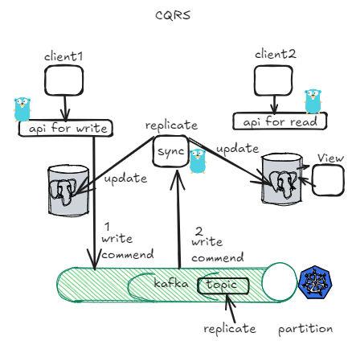

# CQRS System — Go + Kafka + PostgreSQL

Event-driven architecture separating writes and reads via Kafka.

## Architecture




**Write path:** client1 hits the Write API → persists to Write DB → publishes event to Kafka.
**Sync path:** Sync service consumes Kafka events → updates Read DB.
**Read path:** client2 hits the Read API → queries Read DB only.

## Stack

| Component | Technology |
|-----------|------------|
| APIs & Sync | Go |
| Message Bus | Kafka latest (KRaft) |
| Write DB | PostgreSQL 16 (port 5432) |
| Read DB | PostgreSQL 16 (port 5433) |

## Quick Start

```bash
docker compose up -d
```

> **Note:** Use `apache/kafka:latest`, not `batnami`.
> **Note:** Set `KAFKA_CFG_ADVERTISED_LISTENERS=PLAINTEXT://kafka:9092` for inter-container communication.

## Project Structure

```
.
├── docker-compose.yml
├── write-api/        # Kafka producer + Write DB
├── sync-worker/      # Kafka consumer → Read DB
├── read-api/         # Read DB queries
└── k8s/              # Kubernetes manifests
```

## Roadmap

- [x] Infrastructure (Docker Compose, Kafka, PostgreSQL ×2)
- [x] Write API
- [x] Sync Worker
- [x] Read API
- [ ] Kubernetes deployment